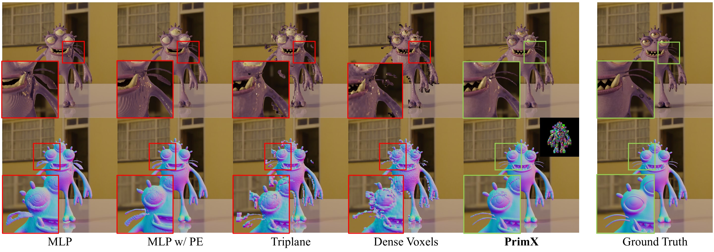

<div align="center">

<h1>3DTopia-XL: High-Quality 3D PBR Asset Generation via Primitive Diffusion</h1>

<div>

<a target="_blank" href="https://arxiv.org/abs/2409.12957">
  
</a>

<a target="_blank" href="https://huggingface.co/spaces/FrozenBurning/3DTopia-XL">
  
</a>
<a href="https://hits.seeyoufarm.com"></a>
</div>


<h4>TL;DR</h4>
<h5>3DTopia-XL is a 3D diffusion transformer (DiT) operating on primitive-based representation. <br>
It can generate 3D asset with smooth geometry and PBR materials from single image or text.</h5>

### [Paper](https://arxiv.org/abs/2409.12957) | [Project Page](https://3dtopia.github.io/3DTopia-XL/) | [Video](https://youtu.be/nscGSjrwMDw) | [Weights](https://huggingface.co/FrozenBurning/3DTopia-XL) | [Hugging Face :hugs:](https://huggingface.co/spaces/FrozenBurning/3DTopia-XL) | [WiseModel](https://www.wisemodel.cn/codes/ZhaoxiChen/3DTopia-XL)

<br>

<video controls autoplay src="https://github.com/user-attachments/assets/6e281d2e-9741-4f81-ae57-c4ce30b36356"></video>

</div>

## News
[02/2025] 3DTopia-XL is accepted to CVPR 2025 :fire:

[02/2025] Training code released!

[10/2024] [WiseModel](https://www.wisemodel.cn/codes/ZhaoxiChen/3DTopia-XL) demo released! 

[09/2024] Technical report released! [](https://arxiv.org/abs/2409.12957)

[09/2024] Hugging Face demo released! [](https://huggingface.co/spaces/FrozenBurning/3DTopia-XL)

[09/2024] Inference code released!

## Citation
If you find our work useful for your research, please consider citing this paper:
```
@article{chen2024primx,
  title={3DTopia-XL: High-Quality 3D PBR Asset Generation via Primitive Diffusion},
  author={Chen, Zhaoxi and Tang, Jiaxiang and Dong, Yuhao and Cao, Ziang and Hong, Fangzhou and Lan, Yushi and Wang, Tengfei and Xie, Haozhe and Wu, Tong and Saito, Shunsuke and Pan, Liang and Lin, Dahua and Liu, Ziwei},
  journal={arXiv preprint arXiv:2409.12957},
  year={2024}
}
```

## :gear: Installation
We highly recommend using [Anaconda](https://www.anaconda.com/) to manage your python environment. You can setup the required environment by the following commands:
```bash
# install dependencies
conda create -n primx python=3.9
conda install pytorch==2.1.2 torchvision==0.16.2 torchaudio==2.1.2 pytorch-cuda=11.8 -c pytorch -c nvidia
# requires xformer for efficient attention
conda install xformers::xformers
# install other dependencies
pip install -r requirements.txt
# compile third party libraries
bash install.sh
# Now, all done!
```

For [proper glTF texture and material packing](https://github.com/mikedh/trimesh/pull/2231), fix a bug in Trimesh (trimesh.visual.gloss.specular_to_pbr #L361) if you are using old version:
```python
    result["metallicRoughnessTexture"] = toPIL(
        np.concatenate(
            [np.zeros_like(metallic), 1.0 - glossiness, metallic], axis=-1
        ),
        mode="RGB",
    )
```

## :muscle: Pretrained Weights

Our pretrained weight can be downloaded from [huggingface](https://huggingface.co/FrozenBurning/3DTopia-XL)

For example, to download the singleview-conditioned model in fp16 precision for inference:
```bash
mkdir pretrained && cd pretrained
# download DiT
wget https://huggingface.co/FrozenBurning/3DTopia-XL/resolve/main/model_sview_dit_fp16.pt
# download VAE
wget https://huggingface.co/FrozenBurning/3DTopia-XL/resolve/main/model_vae_fp16.pt
cd ..
```

For text-conditioned model, please download from this [Google Drive](https://drive.google.com/file/d/1S6aaNtBA8Iv9PCMR-IxbqoB5qNOolqm1/view?usp=sharing)
We put out text conditioner in [models/conditioner/text.py](models/conditioner/text.py). Please download the specific version of text conditioner as follows:
```bash
cd pretrained
wget https://huggingface.co/laion/CLIP-ViT-L-14-DataComp.XL-s13B-b90K/resolve/main/open_clip_pytorch_model.bin\?download\=true
cd ..
```

We will release the multiview-conditioned model and text-conditioned model in the near future!

## :rocket: Inference


### Gradio Demo
The gradio demo will automatically download pretrained weights using huggingface_hub.

You could locally launch our demo with Gradio UI by:
```bash
python app.py
```
Alternatively, you can run the demo online [](https://huggingface.co/spaces/FrozenBurning/3DTopia-XL)

### CLI Test
Run the following command for inference:
```bash
python inference.py ./configs/inference_dit.yml
```
Furthermore, you can modify the inference parameters in [inference_dit.yml](./configs/inference_dit.yml), detailed as follows:

| Parameter | Recommended | Description |
| :---------- | :------------: | :---------- |
| `input_dir` | - | The path of folder that stores all input images. |
| `ddim` | 25, 50, 100 | Total number of DDIM steps. Robust with more steps but fast with fewer steps. |
| `cfg` | 4 - 7 | The scale for Classifer-free Guidance (CFG). |
| `seed` | Any | Different seeds lead to diverse different results.|
| `export_glb` | True | Whether to export textured mesh in GLB format after DDIM sampling is over. |
| `fast_unwrap` | False | Whether to enable fast UV unwrapping algorithm. |
| `decimate` | 100000 | The max number of faces for mesh extraction. |
| `mc_resolution` | 256 | The resolution of the unit cube for marching cube. |
| `remesh` | False | Whether to run retopology after mesh extraction. |


## :hotsprings: Training

### Data Preparation and Mesh2PrimX

#### Raw data: Textured Mesh
We train our model on a subset of [Objaverse](https://objaverse.allenai.org/explore/) dataset. Please refer to the [list](./assets/valid_fitting_2048.txt) where each entry is stored as `{folder}/{uid}`.

#### Raw data: Captions
Our captions can be downloaded from this [Google Drive](https://drive.google.com/file/d/12hJdH-0Ju6Tj_U510o7Zva1lQk1ntOge/view?usp=sharing).

#### Tensorize meshes into PrimX
The first step before training is to converting all textured meshes (glTF format) into PrimX representation (NxD tensor):
```bash
# this only fit one single mesh defined as dataset.mesh_file_path
python train_fitting.py configs/train_fitting.yml
```
The above command only fit a single textured mesh whose path is defined as `dataset.mesh_file_path` in the config file. It can be easily scaled up to the fullset with a parallel fitting pipeline.

The following comparisons illustrate the quality of high-quality tokenization by PrimX:



### VAE Training
To train the VAE for Primitive Patch Compression, run the following command:
```bash
torchrun --nnodes=1 --nproc_per_node=8 train_vae.py configs/train_vae.yml
```
By default, the VAE training relies on PrimX fittings from previous stage whose path template is defined as `dataset.manifold_url_template` in the config file.

### DiT Training
Before the DiT training, we suggest to cache all condition features and VAE features:
```bash
# vae cache, which will use the vae checkpoint as model.vae_checkpoint_path
python scripts/cache_vae.py configs/train_dit.yml
# condition cache
python scripts/cache_conditioner.py configs/train_dit.yml
```

Once caching is done, training DiT for conditional 3D generation can be launched as follows:
```bash
torchrun --nnodes=1 --nproc_per_node=8 train_dit.py configs/train_dit.yml
```

## Acknowledgement

This work is built on many amazing research works and open-source projects, thanks all the authors for sharing!

- [PrimDiffusion](https://github.com/FrozenBurning/PrimDiffusion)
- [MVP](https://github.com/facebookresearch/mvp)
- [DiT](https://github.com/facebookresearch/DiT)
- [nvdiffrast](https://github.com/NVlabs/nvdiffrast)
- [kiuikit](https://github.com/ashawkey/kiuikit)
- [Trimesh](https://github.com/mikedh/trimesh)
- [litmodel3d](https://pypi.org/project/gradio-litmodel3d/)
